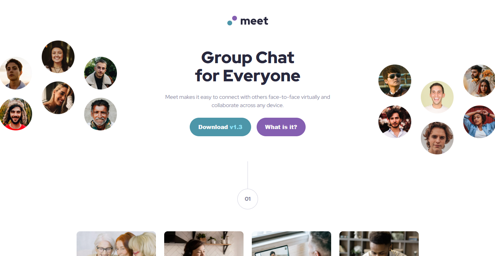

# Frontend Mentor - Meet landing page solution

This is a solution to the [Meet landing page challenge on Frontend Mentor](https://www.frontendmentor.io/challenges/meet-landing-page-rbTDS6OUR). Frontend Mentor challenges help you improve your coding skills by building realistic projects.

## Table of contents

- [Frontend Mentor - Meet landing page solution](#frontend-mentor---meet-landing-page-solution)
  - [Table of contents](#table-of-contents)
  - [Overview](#overview)
    - [The challenge](#the-challenge)
    - [Screenshot](#screenshot)
    - [Links](#links)
  - [My process](#my-process)
    - [Built with](#built-with)
    - [What I learned](#what-i-learned)
    - [Continued development](#continued-development)
    - [Useful resources](#useful-resources)
    - [AI Collaboration](#ai-collaboration)
  - [Author](#author)

**Note: Delete this note and update the table of contents based on what sections you keep.**

## Overview

### The challenge

Users should be able to:

- View the optimal layout depending on their device's screen size
- See hover states for interactive elements

### Screenshot



### Links

- Solution URL: [Github](https://github.com/Odiesta/meet-landing-page)
- Live Site URL: [Netlify](https://sparkly-trifle-85b86f.netlify.app/)

## My process

### Built with

- Semantic HTML5 markup
- CSS custom properties
- Flexbox
- CSS Grid (for the gallery section)
- Mobile-first workflow

### What I learned

1. Multiple background images (gradient overlay + image)

I learned how to layer a semi-transparent gradient on top of a background image using CSS:

```css
.footer {
  background-image:
    linear-gradient(rgba(77, 150, 169, 0.8), rgba(77, 150, 169, 0.8)),
    url("assets/mobile/image-footer.jpg");
  background-size: cover;
  background-position: center;
}
```

The gradient goes first in the comma-separated list so it sits on top of the image. I also learned to use `rgba()` for the gradient color so it's semi-transparent and lets the image show through.

2. The difference between `margin-top` and `transform: translateY()`

I learned that negative margins actually change the layout and pull other elements along with them, while `transform: translateY()` only moves the element visually without affecting the surrounding layout. They're not always interchangeable!

3. CSS custom properties for consistent spacing

I set up CSS variables for spacing (like `--space-200: 1.6rem, --space-800: 6.4rem`) and colors. This made it much easier to keep things consistent across the project and make quick changes in one place.

4. Responsive images for different screen sizes

I used different hero images for tablet and desktop viewports, hiding them with `display: none / display: block` inside media queries. This way, mobile users download a smaller image and desktop users get the full layout with left and right hero images.

### Continued development

1. Understanding the difference between `margin` and `transform`

I realized that `margin` affects the document flow while `transform` only moves things visually. This is something I want to understand more deeply because I've run into unexpected layout issues from using negative margins.

### Useful resources

- [MDN: transform](https://developer.mozilla.org/en-US/docs/Web/CSS/Reference/Properties/transform) - To understand the difference between `transform: translateY()` and `margin-top`, especially how transforms don't affect document flow.

### AI Collaboration

I use Github Copilot with Deepseek API for asking question. The price for asking question is very low.

## Author

- Frontend Mentor - [@Odiesta](https://www.frontendmentor.io/profile/Odiesta)
- Twitter - [@OdiestaS](https://www.x.com/OdiestaS)
